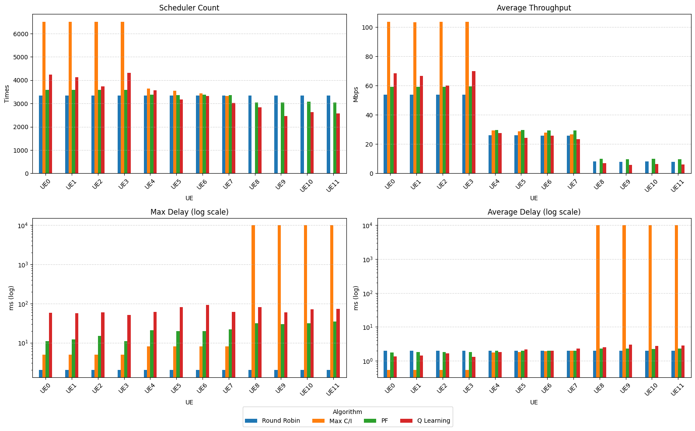
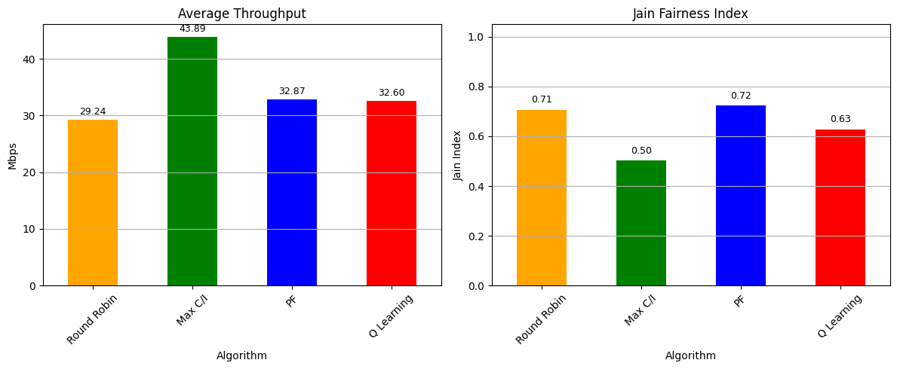

<!-- PROJECT LOGO -->
<br />
<div align="center">
    <p align="center">
        <a  href="https://viettelhightech.vn/">
            
        </a>
        <a href="http://ete.dut.udn.vn">
            
        </a>
    </p>

  <h2 align="center">CAPSTONE PROJECT</h2>
  <h3>Topic: Analysis and simulation of MAC layer resource scheduling algorithms in 5G NR</h3>
  <hr/>
</div>

## Information

### Students: 
- **Le Pham Cong** : **106200221@sv1.dut.udn.vn**
- **Huynh Nhat Anh** : **106200252@sv1.dut.udn.vn** 

### Supervisors:
- **PhD. Van Phu Tuan** — Faculty of Electronics and Telecommunication Engineering, University of Science and Technology, University of Danang (DUT)
- **Engineer. Pham Khanh Trung** — Viettel High Technology Industries Corporation (VHT)

---

## Table of Contents

- [Description](#description)
- [Requirements](#requirements)
- [Implement Simulation](#Implement)
- [Folder Structure](#folder-structure)
- [Result](#result)


## Description
This project simulates and evaluates the performance of different MAC layer resource scheduling algorithms in a 5G NR network environment, include:
* Round Robin
* Proportional Fair
* Max C/I
* Deep Q-Learning

The simulation computes and compares key performance indicators (KPIs) such as:

* Scheduler Count per UE
* Average Throughput
* Maximum Delay between transmissions
* Average Delay

## Requirements
* **Language:** C
* **Compiler:** GCC
* **Operating System:** Ubuntu 22.04 LTS
* **Requirements:**
    * POSIX shared memory
    * POSIX semaphores
## Implement
### Generate Data
The script gen_cqi_table.py generates synthetic CQI (Channel Quality Indicator) and BSR (Buffer Status Report) datasets to simulate uplink transmission conditions for multiple UEs over time.

**Scenario: ideal_condition_bsr100000**

**CQI Distribution:**

- UE0 – UE3: High channel quality (CQI 11–15) — good group

- UE4 – UE7: Medium channel quality (CQI 6–10) — average group

- UE8 – UE11: Low channel quality (CQI 1–5) — poor group

**BSR Values:**

- Generated uniformly within [90,000, 100,000] bits for all UEs


**Output:** Two CSV files are created in the current directory:

- cqi_ideal_condition_bsr100000.csv

- bsr_ideal_condition_bsr100000.csv

Each file contains 20,000 rows (1 per TTI) × 12 columns (1 per UE), making it ideal for evaluating fairness, throughput, and delay handling across diverse link qualities and traffic loads.
```bash
cd Simulation/
cd data/
python3 ./gen_cqi_table.py
```


### Run each algorithm (Using 2 terminals)

To run a scheduling algorithm, open **2 separate terminals**:

#### Terminal 1 – Run the Scheduler

```bash
cd Simulation/ProportionalFair/
./scheduler "./ProportionalFair_Result.csv"
```

#### Terminal 2 – Run the UE Simulation

```bash
cd Simulation/ProportionalFair/
./ue_simulation "./cqiData.csv" "./bsrData.csv"
```

**Note:**

* You must start the **scheduler** first so that shared memory and synchronization semaphores are properly initialized.
* Make sure the `.csv` files are available in the correct directory or provide correct relative paths.
* If you encounter errors related to file/folder paths, please adjust accordingly to your system.


To run other algorithms, replace `ProportionalFair` with one of:

* `MaxC_I`
* `QLearning`
* `RoundRobin`

Each folder contains its own `scheduler` and `ue_simulation` source files.


## Folder Structure
```bash
CAPSTONEPROJECT/
├── Simulation/
│   ├── data/
│   │   ├── bsr_ideal_condition_bsr100000.csv        
│   │   ├── cqi_ideal_condition_bsr100000.csv           
│   │   └── gen_cqi_table.py 
│   ├── MaxC_I/
│   │   ├── bsrData.csv
│   │   ├── cqiData.csv
│   │   ├── MaxC_I_Result.csv
│   │   ├── scheduleMaxC_I.c
│   │   └── ueSimulationMaxC_I.c
│   ├── ProportionalFair/
│   │   ├── bsrData.csv
│   │   ├── cqiData.csv
│   │   ├── ProportionalFair_Result.csv
│   │   ├── scheduleProportionalFair.c
│   │   └── ueSimulationProportionalFair.c
│   ├── QLearning/
│   │   ├── model/
│   │   │   ├── dqn_model_v1.bin
│   │   │   ├── dqn_model_v2.bin
│   │   │   └── dqn_model.bin
│   │   └── result/
│   │       ├── bsrData.csv
│   │       ├── cqiData.csv
│   │       ├── DQL.c
│   │       ├── QLearning_Result_v1.csv
│   │       ├── QLearning_Result_v2.csv
│   │       ├── QLearning_Result.csv
│   │       ├── scheduleQLearning.c
│   │       └── ueSimulationQLearning.c
│   ├── result/
│   │   ├── max_c_i.csv
│   │   ├── pf.csv
│   │   ├── QLearning_Result_v1.csv
│   │   ├── QLearning_Result_v2.csv
│   │   ├── QLearning_Result.csv
│   │   ├── resultAnalysis_v1_deleted.ipynb
│   │   ├── resultAnalysis_v1.ipynb
│   │   └── rr.csv
│   ├── RoundRobin/
│   │   ├── bsrData.csv
│   │   ├── cqiData.csv
│   │   ├── RoundRobin_Result.csv
│   │   ├── scheduleRoundRobin.c
│   │   └── ueSimulationRoundRobin.c
│   ├── clean.c
│   ├── define.h
│   └──TBSArray.csv
├── TBS/
│   ├── define.h
│   ├── TBSArray.csv
│   ├── TBSArray.c
│   ├── 3gpp341-g40.pdf
│   ├── MCSIndexTable1.csv
│   ├── MCSIndexTable2.csv
│   ├── MCSIndexTable3.csv
│   └── TBS_calculate.c
├── .gitignore
└── readme.md
```

| Folder / File                      | Description                                                                      |
| ---------------------------------- | -------------------------------------------------------------------------------- |
| `Simulation/`                      | Main directory for simulation code and result output                             |
| ├─ `data/`                         | Contains scripts and generated datasets (`CQI`, `BSR`) for testing scenarios     |
| ├─ `MaxC_I/`                       | Source code and data for **Max C/I** scheduling algorithm                        |
| ├─ `ProportionalFair/`             | Source code and data for **Proportional Fair** scheduling                        |
| ├─ `QLearning/`                    | Code and model files for **Deep Q-Learning** scheduling algorithm                |
| ├─ `RoundRobin/`                   | Code for classic **Round Robin** scheduling                                      |
| ├─ `result/`                       | Contains CSV outputs and Jupyter notebooks for result visualization and analysis |
| ├─ `define.h`, `clean.c`           | Shared definitions and utilities for memory/semaphore cleanup                    |
| └─ `TBSArray.csv`                  | Transport Block Size mapping file used across schedulers                         |
| `TBS/`                             | References and tools to calculate TBS from 3GPP specs                            |
| ├─ `TBS_calculate.c`, `TBSArray.c` | Code to generate TBS tables from spec                                            |
| ├─ `MCSIndexTable*.csv`            | Modulation and Coding Scheme index tables                                        |
| └─ `3gpp341-g40.pdf`               | Official 3GPP document used for reference                                        |
| `.gitignore`                       | Git file ignore list                                                             |
| `readme.md`                        | Project documentation and usage instructions                                     |

## Result
<p align="center">
  
</p>
Fig 1. Statistical chart by criteria for each user

<p align="center">
  
</p>
Fig 2. Statistics chart of cell throughput and fairness


<!-- ABOUT THE PROJECT -->
